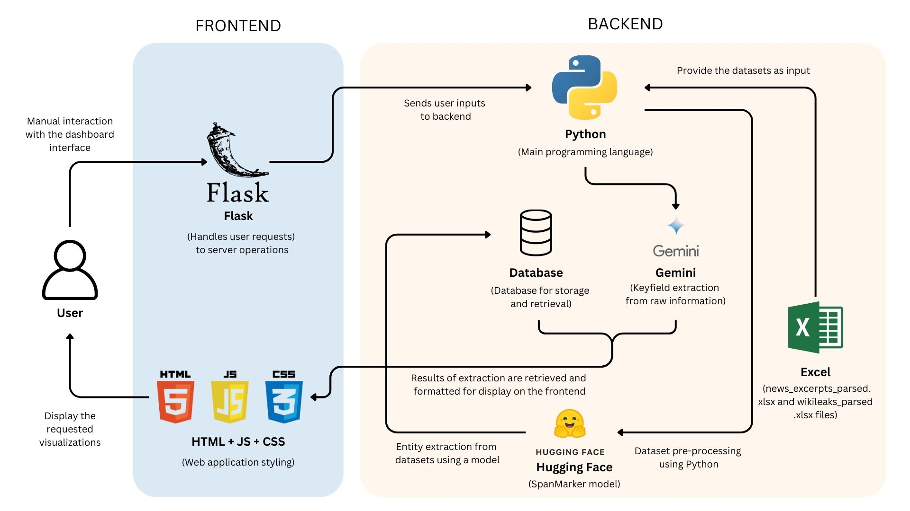

# AI-Powered Text Analytics Tool  

## Executive Summary  

In today’s data-driven world, organizations, researchers, and analysts face the challenge of extracting meaningful insights from vast amounts of unstructured text. Our AI-powered analytics tool provides a comprehensive solution for entity recognition, relationship mapping, and interactive exploration, enabling users to uncover patterns, detect key influencers, and analyze trends in complex datasets.  

This project was developed as part of the **SMU Datathon 2025**, showcasing advanced **Natural Language Processing (NLP)**, **data visualization**, and **AI-powered analysis** to transform unstructured text into structured intelligence.  

## Core Features  

- **Entity Analysis**: Identifies and categorizes key entities while tracking their frequency over time.  
- **Entity-Relationship Table**: Structures interactions between entities with metadata and filtering options.  
- **Knowledge Graph**: Visualizes entity relationships dynamically, identifying clusters and sentiment-based links.  
- **Chatbot Interface**: Enables AI-powered natural language queries for deeper insights.  

## High-Level Architecture  

Our system is built using a modular architecture:  

### Frontend Layer (User Interface)  
- **Web App**: Built with **Streamlit/React** for interactive exploration.  
- **Visualization Engine**: Uses **Plotly, D3.js** for entity graphs and charts.  

### Backend Layer (Processing & APIs)  
- **Flask API**: Handles entity extraction and data retrieval.  
- **Google Gemini API**: Provides conversational AI and document insights.  
- **Database APIs**: Enables querying and filtering of entity relationships.  

### Data Processing Layer (NLP & Relationship Mapping)  
- **SpaCy NLP Pipeline**: Performs entity extraction.  
- **NetworkX**: Supports graph processing to identify entity relationships.  
- **Gemini**: Chatbot feature and document uploads.
 

### Architecture Diagram  

 

## Workflow Summary  

1. **User uploads a text or document** → The system extracts entities and relationships.  
2. **Data is processed and stored** → Sentiment and relationship strength are analyzed.  
3. **User explores insights** via interactive dashboards and knowledge graphs.  
4. **Chatbot allows real-time Q&A** → Answers are contextually generated using AI.  

## Live Demo & Video Demonstration  

- **Live Demo**: [Click here](https://smu-datathon.onrender.com/)  
- **Video Demonstration**: [https://youtu.be/s-kYu3vvxlI]  

## Contributing  

We welcome contributions! Feel free to open issues or submit pull requests.  

## License  

This project is licensed under the MIT License - see the LICENSE file for details.  
